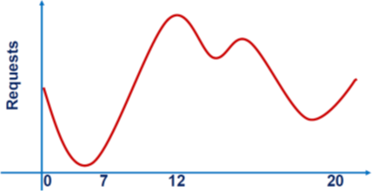
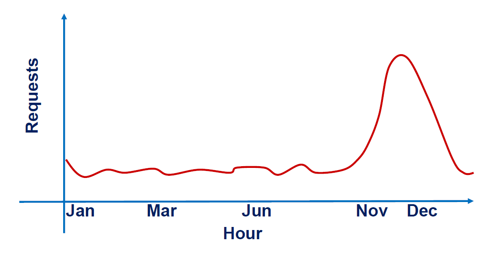
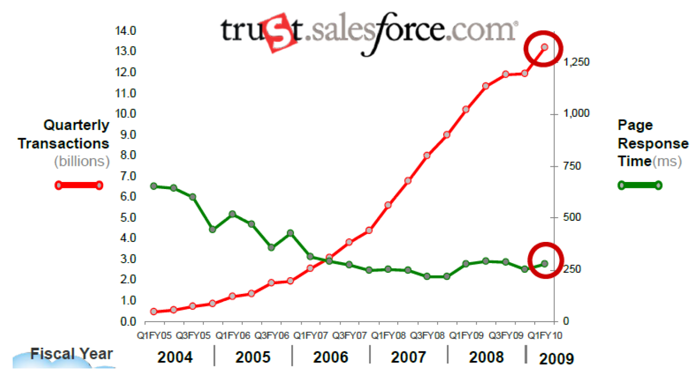
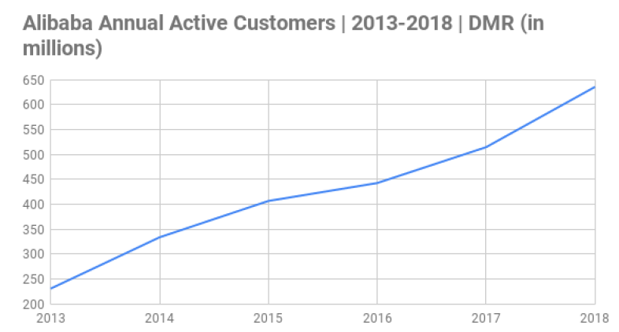
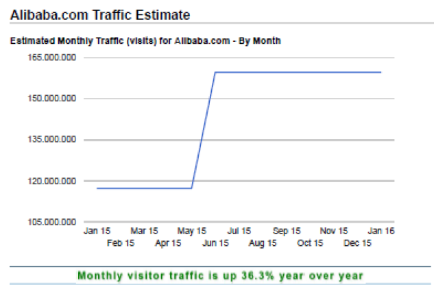
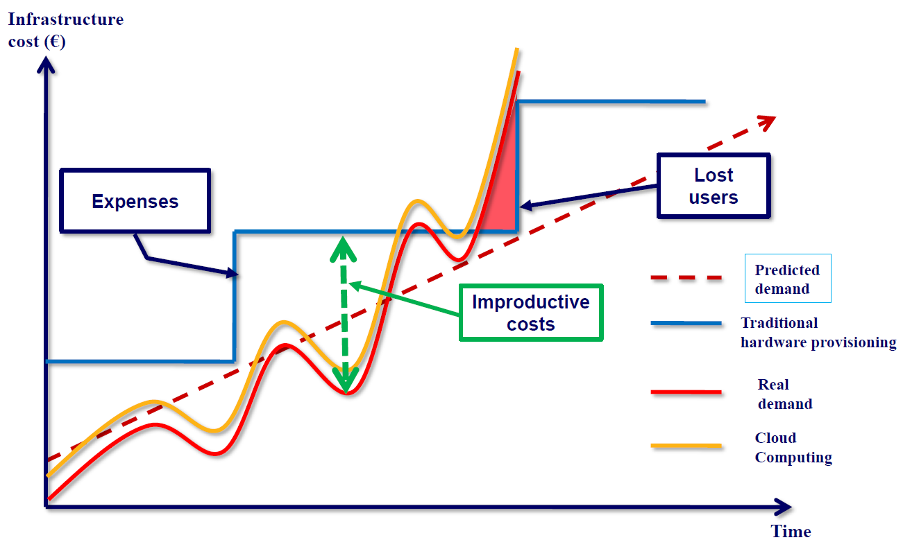

# Intro To Cloud Computing
 A gentle introduction to Cloud Computing e concepts behind it.

 ## Course Goals
 ...

 ## Table Of Contents
 ...

---

# What is Cloud Computing? 

Cloud Computing is a technological paradigm enabling on-demand access of computational resources through the internet. 
The internet acts as the foundational technology for the cloud, providing the connectivity tissue for cloud computing: 
- It enables communication between **devices** and **servers** distributed around the world.
- It allows **remote access** to **computational resources** without the need for local hardware.
- It has enabled the development of **web-based applications** such as Google Drive, Dropbox and Office 365.

Cloud computing leverages this infrastructure to offer scalable and accessible services anywhere.

## From the Internet to the Cloud

To understand cloud computing, it is essential to start with the basics: the ***Internet***.

- **1960s:** ARPANET, the **first computer network**, is born, laying the foundation for the Internet.
- **1980s:** The **TCP/IP protocol is developed**, allowing computers to communicate with each other on different networks.
- **1990s:** Tim Berners-Lee introduces the **World Wide Web** (WWW), enabling the spread of websites and online services.
- **2000s:** As fast, reliable Internet connections become increasingly available, companies begin to provide **software** and **infrastructure** as **online services**, giving rise to ***cloud computing***.

> [!NOTE]
>
> What is the difference between ***Internet*** and the ***World Wide Web***?

Internet and the WWW opened information systems to the world, ***literally***.

> [John McCarthy, MIT Centennial, 1961]: "Computing may someday be organized as a public utility"
> [Mark Weiser, Xerox PARC, 1996]"The most profound technologies are those that disappear. They weave themselves into the fabric of everyday life until they are indistinguishable from it"
> [Jeff Bezos, CEO Amazon, 2006]: "Let us use our spare resources for making profit by offering them as services to the public"
> [Steve Ballmer, CEO Microsoft, 2016]: "The cloud is the future, everything else is accessory"

As water, electricity and Gas, nowadays the Internet is a utility, almost a commodity. The actual and future solutions moved from past models technology delivery model to a service delivery model. 

> A **service** is the ability of a system (belonging to a **Service Provider**) of delivering continuously one or more responses in te presence of specific requests to the system by a customer, or **Service Requestor**. 

In this model, there is: 
- a ***customer***;
- a ***service provider***;
- a ***continuity factor*** that the service provider must guarantee (it introduces objective concepts as Service Level Agreement - SLA, or subjective concepts as reputations and trust).

### Internet and Services: new Technology means new Challenges 

When the internet was born, it was impossible for system designer to build a reliable infrastructure, as: 
- system designers did not know how many users could reach the service; 
- system designeres did not know requests mix; 
- service times might have very different order of magnitude in time, i.e., from msec to sec; 
- the service could be suject to hotspots, burst arrivals, ... 
- enormous increase or decrease of requests can happen in a time period, from seasons, to months, to day, to hours ... 

    

<figcaption style="text-align:center;"><em>Typical daily workload of a random service</em></figcaption>

 

    
    

<figcaption style="text-align:center;"><em>Possible daily workload in a defined time-zone</em></figcaption>

 

    

<figcaption style="text-align:center;"><em>Potential e-commerce seasonality</em></figcaption>

 

    

<figcaption style="text-align:center;"><em>Periodic peaks associated to sports events (e.g., Australia Open)</em></figcaption>

 

    

<figcaption style="text-align:center;"><em>Salesforce transactions in a quarter, from 200k to 13 billion</em></figcaption>

 

    
    

<figcaption style="text-align:center;"><em>Number of visitors of Alibaba.com</em></figcaption>

 

    

<figcaption style="text-align:center;"><em>CNN hits from 2 to 1 billion a day</em></figcaption>

 

    

<figcaption style="text-align:center;"><em>Unique visitors to Ebay</em></figcaption>

 

    

<figcaption style="text-align:center;"><em>Elastic Sizing: the Cloud innovation</em></figcaption>

 

    

<figcaption style="text-align:center;"><em>Prevalent Cloud Service pardigms</em></figcaption>

---
 # Credits
Thanks to Dr. Marco Mamei for sharing content and suggestions for the design of this course.

# License  
- The **code** in this repository is licensed under the **MIT License**. See [LICENSE](LICENSE) for details.  
- The **documentation and educational materials** are licensed under **CC BY 4.0**. See [LICENSE-docs.md](LICENSE-docs.md) for details.  