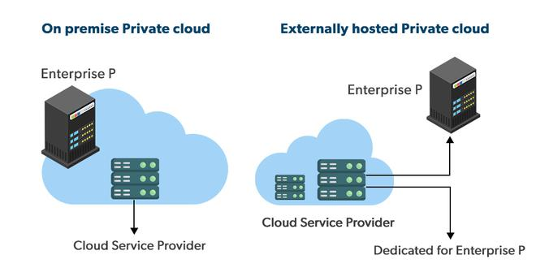
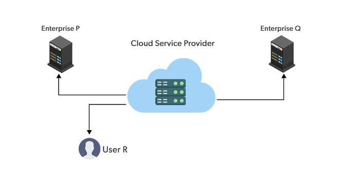
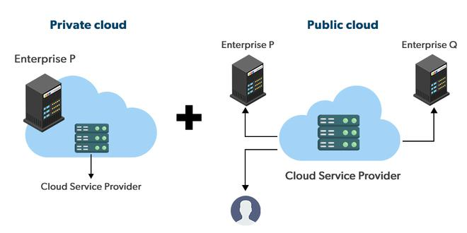

# Cloud Computing Paradigms

Having defined the focus on services, the question becomes ... ***what kind of services can a business owner offer out from a bunch of servers***?

The answer is: everything ... ***everything as a service*** (**EaaS** or **XaaS**).

... Well, in reality two main paradigms exist: 
- Service Model; 
- Deployment Model.

### Service Model

    

    <figcaption>
        <em>Prevalent Cloud Service pardigms from RedHat</em>
         
         
    </figcaption>

A portion of the service stack is bought by a service provider (e.g., GCP, AWS, RedHat ...), and on top of that the business owner builds its service to deliver.

If the server itself is owned by the business owner, than it means ... that have a giant server in your server room, with the whole stack to be managed. 

On the opposite ... you are just buiyng a service and using it on someone elses servers. 

>[!TIP]
>
> Can you name a SaaS Service? 

### Deployment Model 

- **Private cloud**: the infrastructure is operated solely for an organization. It may be managed by the organization itself (*private*) or by a third party (*exclusive cloud*), and may be on-premise or off-premise;

    

    <figcaption>
        <em>Private cloud model by GeekforGeeks</em>
         
         
    </figcaption>

- **Community cloud**: the infrastructure is shared by several organizations and supports a specific community that has shared concerns (e.g., business mission, security requirements, policy, and compliance considerations). It may be managed by the organizations or by a third party and may exist on-premise or off-premise;
- **Public cloud**: the infrastructure is made available to the general public or a large industry group and is owned by an organization (i.e., cloud provider) selling one or more types cloud services;

    

    <figcaption>
        <em>Public cloud model by GeekforGeeks</em>
         
         
    </figcaption>

- **Hybrid cloud**: the infrastructure is a composition of two or more deployment models (private, community, or public) that remain unique entities but are bound together by standardized or proprietary technology (i.e., *integration system*) that enables data and application portability.

    

    <figcaption>
        <em>Hybrid cloud model by GeekforGeeks</em>
         
         
    </figcaption>

### The Business and Technological points of views of the cloud: two sides of the same coin

User's point of view: 
- Logically isolated set of resources (disk, memory, processor, network); 
- Elastic (direct and reverse scalability)
- Reliable (always available)
- Secure
- Pay-per-use cost model

Enginnering's point of view: 
- Racks
- PODs
- Storage
- Networking
- Virtualization
- Monitoring
- Management and billing
- Power and cooling systems
- Security measures (access limitation systems to building, cameras, ...)

### But ... Is your application scalable? 

Elasticity and availability attributes are what makes the cloud appealing. Nevertheless, the cloud alone can not make your application scalable as well, by just porting it.

So, when an application is able to scale/rescale similarly? When it avoids: 
- System and software bottlenecks; 
- Single points of failures; 
- Synchronous communication.
