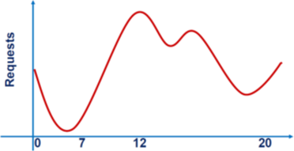
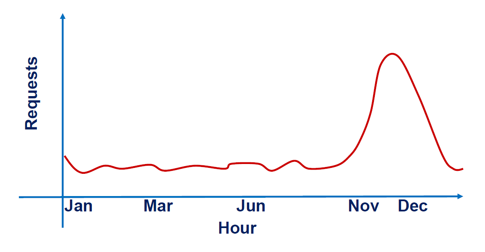
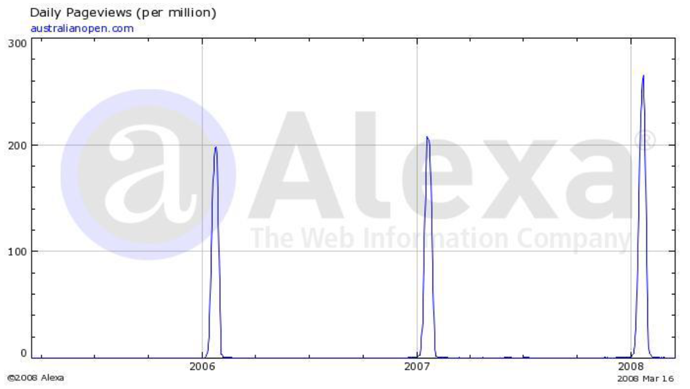
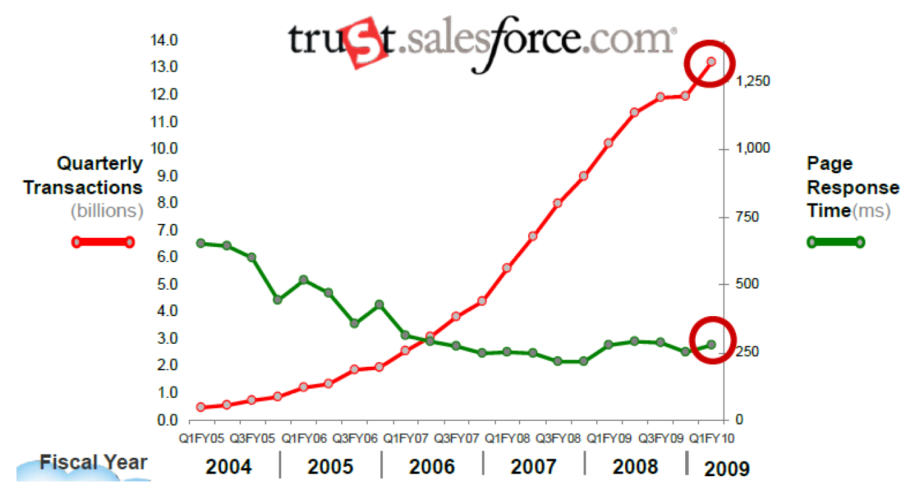
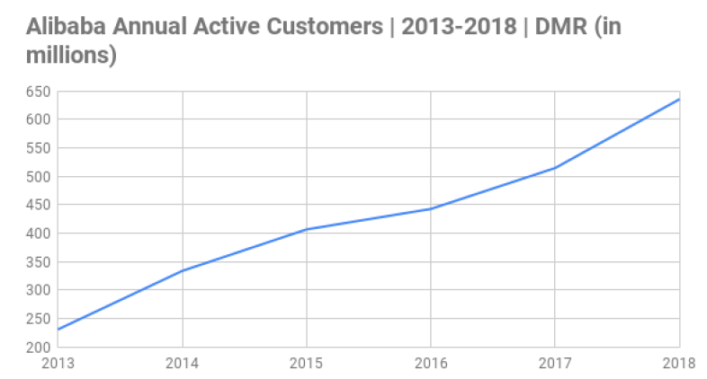
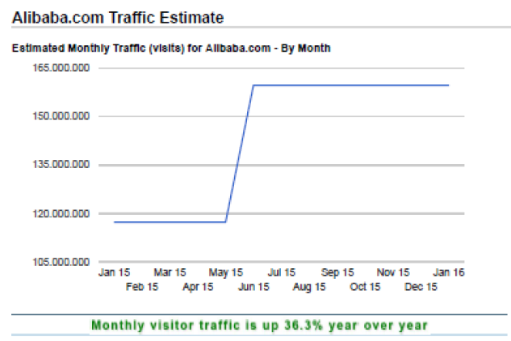
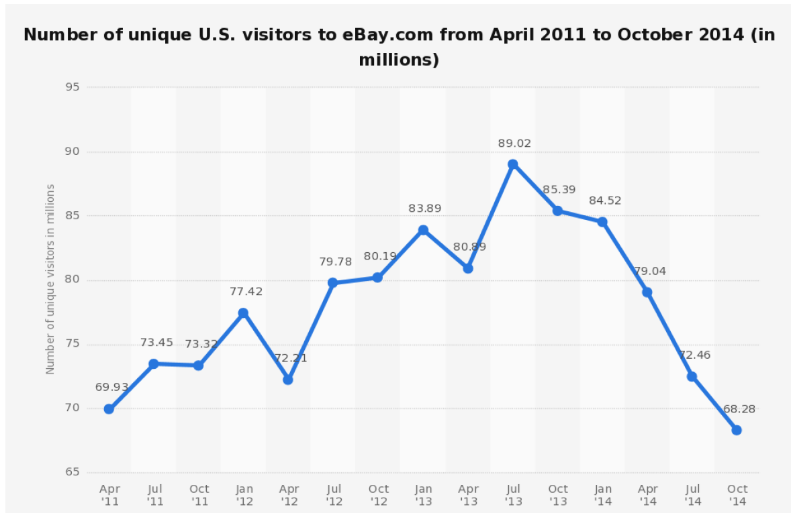
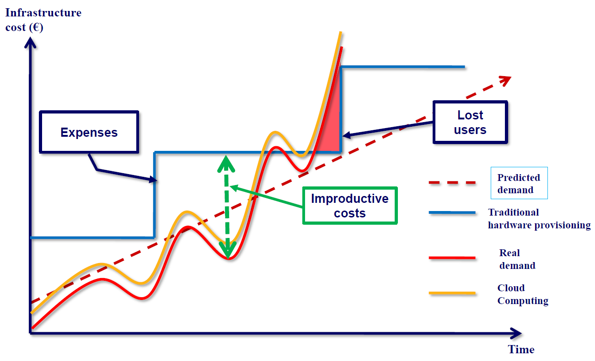

# Internet and Services: new Technology means new Challenges 

When the internet was born, it was impossible for system designer to build a reliable infrastructure, as: 
- system designers did not know ***how many users*** could reach the service; 
- system designeres did not know ***requests mix***; 
- service times might have ***very different order of magnitude in time***, i.e., from msec to sec; 
- the service could be suject to ***hotspots***, ***burst arrivals***, ... 
- enormous ***increase*** or ***decrease of requests*** can happen in a time period, from seasons, to months, to day, to hours ... 

<picture style="display: flex; justify-content: center; gap: 3vw;">
    
</picture>
<figcaption style="text-align:center;"><em>Typical daily workload of a random service</em></figcaption>

    
    

<figcaption style="text-align:center;"><em>Possible daily workload in a defined time-zone</em></figcaption>

    

<figcaption style="text-align:center;"><em>Potential e-commerce seasonality</em></figcaption>

    

<figcaption style="text-align:center;"><em>Periodic peaks associated to sports events (e.g., Australia Open)</em></figcaption>

    

<figcaption style="text-align:center;"><em>Salesforce transactions in a quarter, from 200k to 13 billion</em></figcaption>

    
    

<figcaption style="text-align:center;"><em>Number of visitors of Alibaba.com</em></figcaption>

    

<figcaption style="text-align:center;"><em>CNN hits from 2 to 1 billion a day</em></figcaption>

    

<figcaption style="text-align:center;"><em>Unique visitors to Ebay</em></figcaption>

Under an economical perspective, such limitations have a huge impact on businesses: 
- If your site does not work, or takes too long to load, cutstomers may not return for a long time - or forever; 
- If your competitor's site is up and responsive, you may lose a sale; 
- If your customer do repeteadly live a bad site experience, he will start to associate that poor quality to the brand of the site, losing reputation. 

By the way, there is also an opposite perspective: 
- Your site can be very reliable and stable, but if your userbase decreasese and time and you do not have the opportunity to re-scale the system ... it means part of your money is immobilized for no reason! 

Business environments make ***zero tolerance*** for any unresolved complaint, and ***zero tolerance for any wasted resource***.

> [Jeff Bezos, CEO Amazon, 2006]: "Let us use our spare resources for making profit by offering them as services to the public"

Here comes the BIG impact of cloud computing: ***elastic sizing***.

    

<figcaption style="text-align:center;"><em>Elastic Sizing: the Cloud innovation</em></figcaption>

Some of cloud services key-features:
- **Scalability:** Resources can be increased or decreased based on demand.
- **Elasticity:** Ability to automatically adapt to changes in load.
- **Global Accessibility:** Services are available anywhere there is an Internet connection.
- **Pay-per-use pricing:** You only pay for the resources you use.

## From Technology Delivery towards Service Delivery 

A new generation of users are coming, that may not be strictly technology geeks. Those people know technology ***through services provided through it***, such as Google, Facebook, YouTube, GMail, GDrive, Twitter, iTunes, ... 

All these services share the common characteristic of being ***robuts***, ***secure***, ***scalable***, ***usable***, and, sometimes, ***appartently free***.

>[!NOTE]
>
>But it was not always like this!

Such characteristics has been made possible because of the Internet, the Web and all the associated innovations arose during time. 
All of them, indeed, posed the problem of scale (your customer base, the region where your service is distributed, your country, the world), neved addressed before by engineers and computer scientists. 

The scalability problem moved the focus of IT business from being a technology provider to be a service provider. And the provided services must be: 
- ***robuts***;
- ***secure***;
- ***scalable***;
- ***usable***.

### How much does a service provider lose from an outage? 
- Ebay: from 2000$ to 4000$ ... *per second*; 
- Amazon: about 100.000$ per minute; 
- Facebook: 130.000$ per minute. 