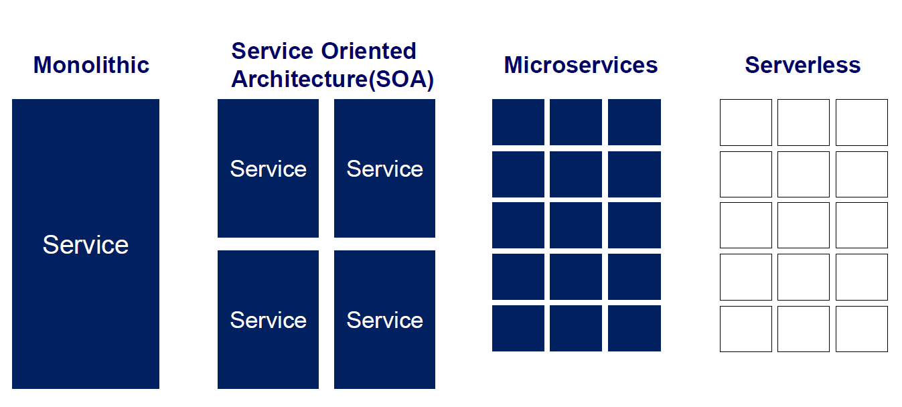
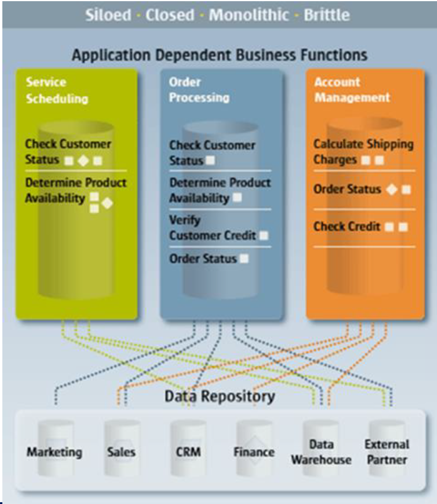
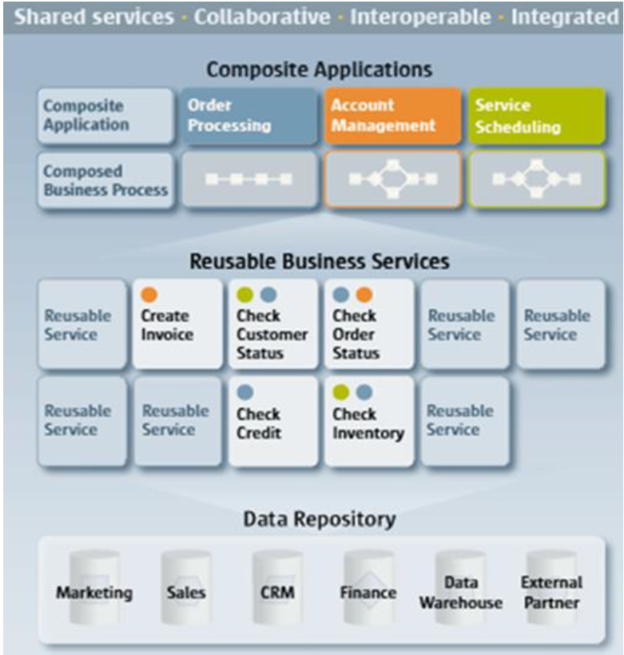
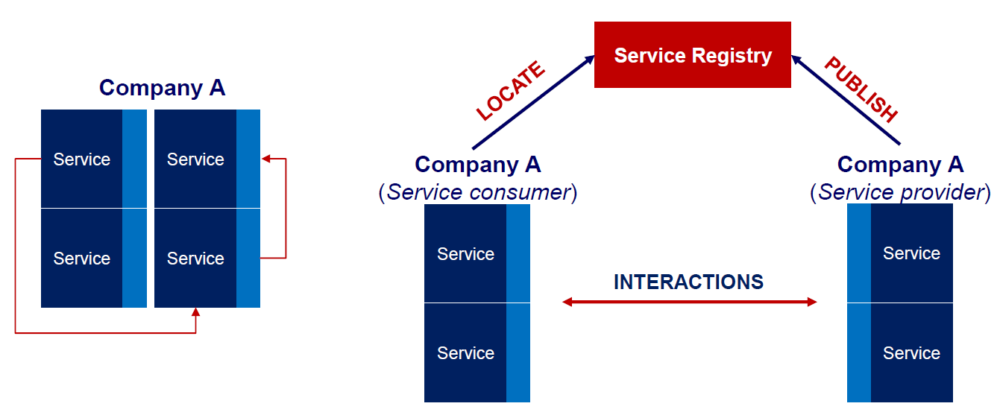
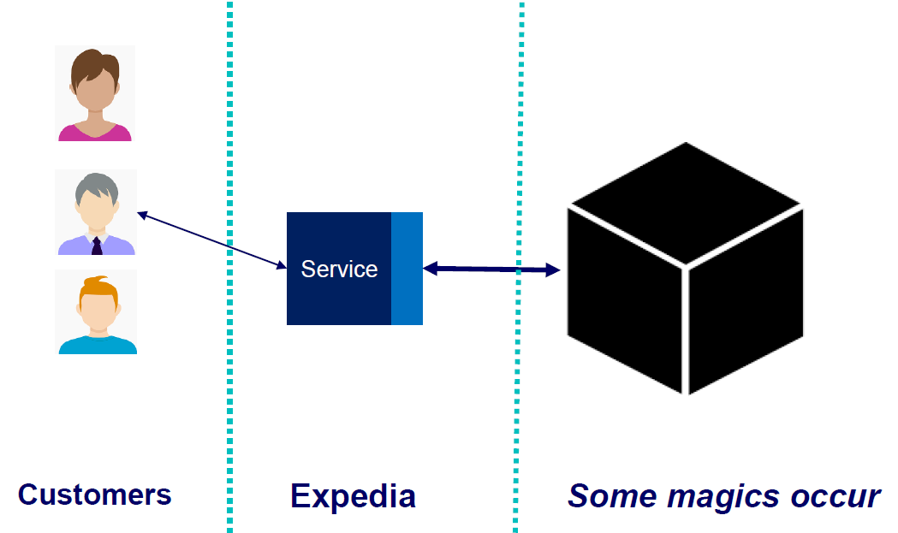
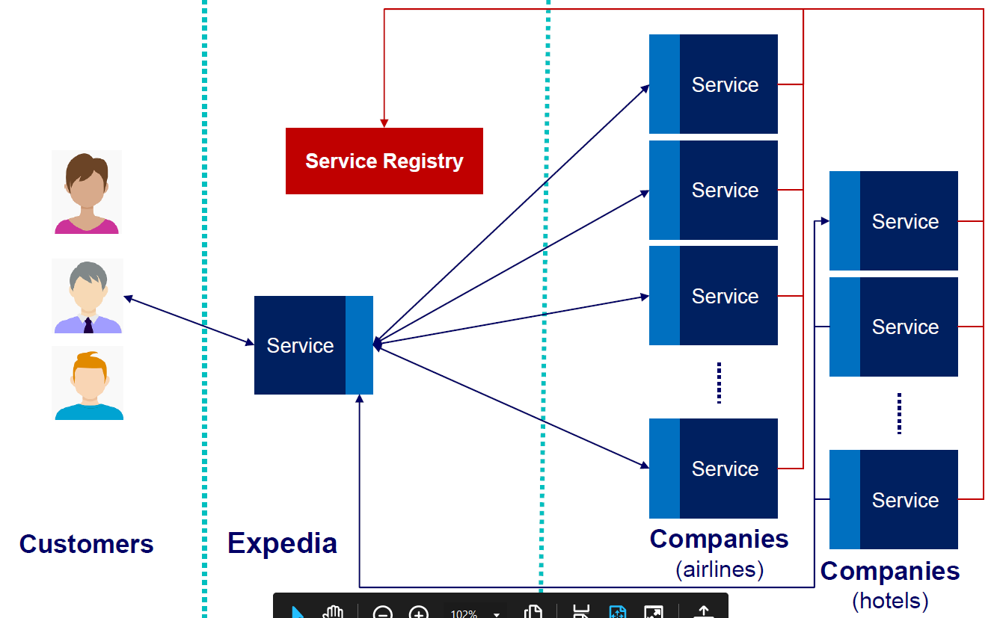
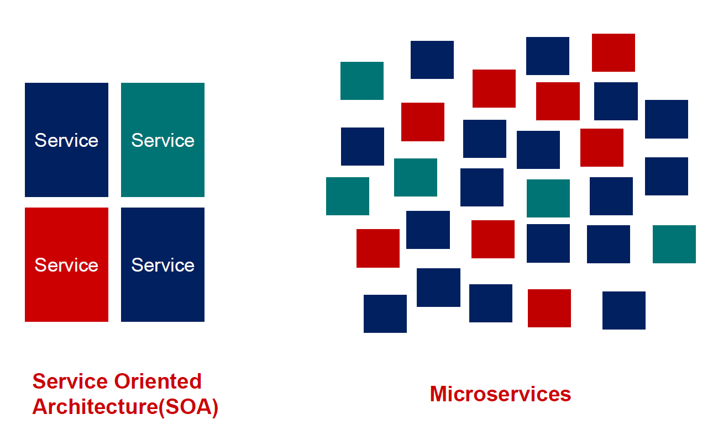
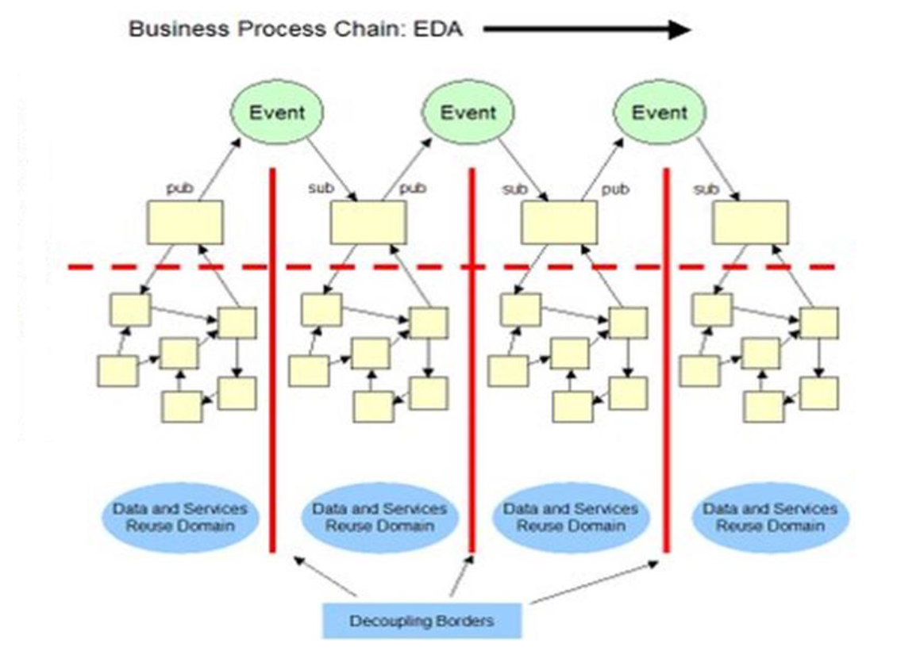

<!-- TODO: Add here the section about microservices -->

# IT Innovations: Cloud-Enabled Approaches and the next Innovation Cycle

## Cloud, Service-Oriented Architectures and Microservices

Through time, 4 main ways to implement a has been adopted: 
1. Monolithic
2. Service Oriented Architecture (SOA)
3. Microservices
4. Serverless

The big picture reporting differences among these approaches is reported below. 
 <!-- TODO: Change, personalize, add caption -->

The evolution is mainly based on the idea of implementing applications based on distributed systems, to allow interoperability between functions and even among several monolithic applications, and the idea was there way before the advent of SOA.

<!-- TODO: Monolithic, siloed, architecture. Change, personalize, add caption -->

Then, SOA came up in 2000, bringing an new approach to building principles of IT services. 
But ... *What is a Service-Oriented Architecture?*

> A ***Service-Oriented Architecture*** is a *business driven IT architectural approach* that is based on software building blocks that help a company to:
> * avoid to design a monolithic software architecture
> * avoid details of the underlying IT architecture
> * lower integration, modification and maintenance costs
> * reuse their software investments for building other services
> * increase flexibility of business processes by adapting IT quickly even for novel  with increasing complexity
> * obtain sustainable competitive business advantages through IT

Its conceptual principles are collected in ***[the Service-Oriented Manifesto](https://soa-manifesto.org/default.html)***.

<!-- TODO: SOA. Change, personalize, add caption -->

It was (and actually is) applied to three main scenarios: 
1. SOA for intra-company applications
2. SOA for inter-company applications, where there are established Business to Business (B2B) relationships 
3. SOA for inter company applications, where offered services are openly usable (late ’90: building an ideal open market of services)

Within intra-company, it supports: 
* The creation of new services based on old services, reused as an embedded version
* The creation of a new service levereaging existing ones, and their discovery through a service registry

<!-- TODO: Change, personalize, add caption -->

### Example: Expedia

<!-- TODO: Change, personalize, add caption -->

### SOA and the Enterprise Service Bus

The cornerstone of the SOA is the Enterprise Service Bus, or ESB.
The ESB is the element that *connects* all the involved applications, decoupling them and promoting the architecture modularity.

ESB is a middleware that provides the technical infrastructure and tools to host applications and services and facilitate their interactions through several mechanisms, among which:
* Base routing messages to destination
* Managing different communication models and ways of interactions among services, such as: a synchronous queuing, event driven messaging, reliable messaging, service intermediation (brokering)
* Connectors and bridges for different protocols transforming data and protocols between service requestor and service provider
* Handling business events and delivering them by providing policies and Quality of Service (QoS), and also mechanisms for monitoring, logging, and security

The result is an application fragmentation (actually ***ongoing***), moving systems from monolithic to fine grained and reusable services. 
Coupling happened through the usage of orchestration and communication tools.

## From SOA to Microservices

SOA broke the monolithic software, integrating legacy application and promoting resusability across different software. Nevertheless, Cloud-based applications required a step forward, looking for easier services implementation, more agility and elasticity, higher reusability, and an independence from servers, tools and DBs. In particular, ESB represented a bottleneck, something to be avoided in order to prevent fails or scalability limits. 

A valid Cloud-based service is required to be: 
* resilient
* ready for failure
* elastic
* loosly-coupled
* stateless as possible.

<!-- TODO: Change, personalize, add caption -->

But ... What are Microservices? 

A Microservice is an ***architectural approach*** to: 
* develop a single application as a suite of very small business tasks implemented as services ...
* ... each running in its own thread ...
* ... and communicating with through some lightweight mechanisms (often an HTTP resource API).

> [!NOTE] These services may be written in ***different programming languages*** and use ***different data storage technologies***, and require an orchestration system to ***independently deploy them*** by ***fully automated mechanisms***.

### How to define a Microservice

Even if the word "micro" may recall the dimension of the software, it is not the central point that allows someone to call a service "micro". Indeed, a microservice is: 
* single purpose
* well defined and simple interface
* modular
* independent
* isolated persistence (each microservice has to manage its storage data)

Example: a Car Insurance service. 

The whole service is about making an online car insurance request.
It can be split down in the following *microservices*:

1. Receive the client request
2. Verify whether the client is an already registered customer
3. Check the level of risk of a specific car
4. Evaluate the insurance premium
5. Send the proposal to the customer
6. Wait for the customer
7. Re send the proposal if the customer does not reply within N days …
8. ...

> Implementing them as a microservice, makes it possible to build bigger, complex, reusable, modular, scalable services.

<!-- TODO: Evaluate if to change with C-GPT generated content -->

## SOA vs. Microservices: differences? 
Both SOA and microservices allow a complex application to be broken down into smaller more manageable, and somewhat independent pieces.
 
Given the fact that dividing an application into smaller parts could be handled by either SOA or microservices, there are those who insist that there is not a real difference between the two architectures.

In fact, there are some crucial differences between the two architectures, and these differences play into the ways in which the architectures should be used:

<!-- TODO: Present as a table of SOA vs MS -->
1. SOA Web based services are today considered as coarse grain services , because they are developed and deployed as large units. In contrast, microservices are developed independently , and can even be built using different tools and different languages, so long as the microservices conform to the standards set forth by the API.

2. Microservices tend to be far more granular than SOA. They do one thing, and do it well even because each of them is well tested.

3. Microservices also tend to be easier to test than monolithic services , because they perform just one function. They and are designed for reuse and to work independently.

4. Microservices are individual services that are able to communicate with one another through APIs and not through an ESB.

5. Microservices are truly independent of one another:
– It might be possible to upgrade a microservice without upgrading any of the other application components
– It might be possible to shut down microservices that are not currently being used, without impacting the other microservices that would continue their execution

6. Typically, there is a logical separation between microservices: individual microservices often run in (cloud based) containers

## Microservices and enabled technologies

Having several microservices designed and deployed independently allowed for several technological improvements: 
- continuous implementation and deployment (DevOps) of large, complex applications:
    - Better testability services are smaller and faster to test
    - Better deployability services can be deployed independently
    - It enables you to organize the development effort around multiple teams. Each team owns and is responsible for one or more services. Each team can develop, deploy and test their services independently
- Each microservice is relatively small
- Easier for a developer to understand:
    - The application starts faster, which makes developers more productive, and speeds up tests and deployments
- Improved availability through fault isolation and replication
    - For example, if there is a memory leak in one service, then only that service is affected

Drawbacks are limited, but exist:
- Most developer tools do not provide (yet) explicit support for implementing and testing several distributed microservices
- Still lack of competences in thr developer community
Developers must implement
- Microservices need implementation for:
    - Complex inter service communication mechanisms
    - complex orchestration mechanisms: in production, there is the operational complexity of deploying, managing and monitoring a system consisting of many different services and service types
- Increased process and memory consumption
    - The microservice architecture replaces N monolithic application instances with N x M services instances. The overhead is much higher as well as the related communication costs
- Microservices expose several complexities and challenges hidden by the SOA approach, such as: 
    - communication
    - coordination
    - service discovery.

Most large web-based services such as Amazon, Ebay, Netflix, moved from a SOA to a full Microservice deployment. 

<!-- TODO: Change to a different callout -->
> [!NOTE]
>
> - **eBay**: Monolithic Perl > Monolithic C++ > SOA Java > microservices
> - **Twitter**: Monolithic Ruby > SOA Java / Scala > microservices
> - **Amazon**: Monolithic Perl / C++ > SOA Java / Scala > microservices

### Communication in Microservices

There is not just one solution for building cloud applications based on microservices but some architectural approaches have proven success for elasticity and availability:
- RESTful services
- Event-Driven Architectures

The ***RESTful Architectures*** are based on API that follow REST principles, using the HTTP protocol for CRUD operations on resources identified by URL. 
They are *stateless*, scalable and ideal for web applications and microservices, but they can be inefficient for highly dynamic scenarios. 

The ***Event-Driven Architectures (EDA)***, on the other hand, revolve around *events*, where the components react to asynchronous notifications via queues of messages (e.g. Kafka, Rabbitmq). 
This approach improves scalability and decoupling, making it ideal for distributed and real-time systems, but more complex to manage than Rest.

In particular, through EDA is possible to model ***domain-events***, that are actual events domain experts care about. Domain events can be also used to for communication between microservices, enabling ***event-driven microservices***.

<!-- TODO: Change, personalize, add caption -->

EDA are key for ***elasticity*** and ***scalability*** of the cloud.

## What will come next?

So: what will come ***after the Cloud?*** 

    

    <figcaption>
        <em>IT innovation cycles</em>
         
         
    </figcaption>

Let's take a look to nowadays Cloud problems.

Cloudification may have a problem: the ***network latency***.  
Indeed, cloud computing is not viable for most real time and industrial applications.

How to overcome this problem? ***Shortening the communication channel***, that means ... moving the ***cloud closer to the ground***, that means ... moving towards the ***fog***.

> The ***Fog*** is ***Cloud closer to the ground***.

The fog extends concepts of the cloud computing closer to the place where data is generated. 

In this way, latency-sensitive applications can be executed at the edge of the network, while other applications will run in the cloud.

> [!NOTE]
>
> There is no global agreement on the difference between *fog* and *edge* computing.
> 1) Are they synonymous?
> 2) Is FOG any type of intermediate computation between IoT and Cloud?
> 3) Is FOG any type of intermediate computation and EDGE the way to implement it?
> 4) Is FOG specific for IoT and smart devices while EDGE is specific for critical applications (industrial, autonomous driving, healthcare, etc.)?
> 5) ... *whatever*?
