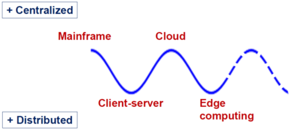

# IT Innovations and the next Innovation Cycle

So: what will come ***after the Cloud?*** 

    

    <figcaption>
        <em>IT innovation cycles</em>
         
         
    </figcaption>

Let's take a look to nowadays Cloud problems.

Cloudification may have a problem: the ***network latency***.  
Indeed, cloud computing is not viable for most real time and industrial applications.

How to overcome this problem? ***Shortening the communication channel***, that means ... moving the ***cloud closer to the ground***, that means ... moving towards the ***fog***.

> The ***Fog*** is ***Cloud closer to the ground***.

The fog extends concepts of the cloud computing closer to the place where data is generated. 

In this way, latency-sensitive applications can be executed at the edge of the network, while other applications will run in the cloud.

> [!NOTE]
>
> There is no global agreement on the difference between *fog* and *edge* computing.
> 1) Are they synonymous?
> 2) Is FOG any type of intermediate computation between IoT and Cloud?
> 3) Is FOG any type of intermediate computation and EDGE the way to implement it?
> 4) Is FOG specific for IoT and smart devices while EDGE is specific for critical applications (industrial, autonomous driving, healthcare, etc.)?
> 5) ... *whatever*?
